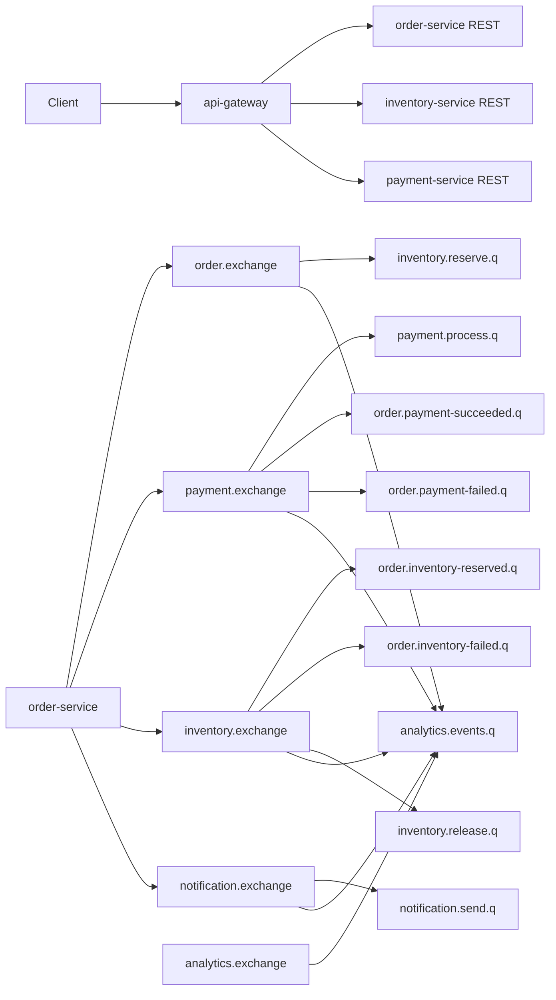

# Architecture

## Module map

| Module | Role | Key responsibilities |
|---|---|---|
| `techlab-common` | Shared library | `BaseEntity`, `ApiResponse`, `EventEnvelope`, exception handling, correlation/user-context filters, RabbitMQ constants and common message converter |
| `api-gateway` | Edge service | Demo auth API, JWT issuance/validation, request routing, centralized Swagger/OpenAPI entry point |
| `order-service` | Saga orchestrator | Create/read orders, publish `order.created`, react to inventory/payment events, trigger compensation and notifications |
| `inventory-service` | Stock service | Product admin APIs, atomic stock reservation/release, publish inventory reservation outcomes |
| `payment-service` | Payment service | Simulated payment processing, payment attempts, publish payment success/failure |
| `notification-service` | Notification service | Persist/send notification requests and emit notification delivery status |
| `analytics-service` | Event sink | Consume all domain events via wildcard bindings and persist analytics records |

## Gateway authentication flow

1. A client calls `POST /api/auth/register` or `POST /api/auth/login` on `api-gateway`.
2. `AuthController` delegates to `AuthServiceImpl`, which stores demo users in `gateway_users` and issues an HS256 JWT via `JwtService`.
3. For non-public routes, `JwtAuthFilter` validates the `Authorization: Bearer <token>` header.
4. After validation, the gateway injects:
   - `X-User-Id`
   - `X-User-Name`
   - `X-User-Role`
5. The gateway forwards the request to the downstream service selected by `GatewayConfig`.
6. In downstream services, `UserContextFilter` reads the injected headers into `UserContextHolder`.
7. Downstream services do not validate JWT themselves; they trust the gateway boundary.

Public paths configured in `GatewayProperties` bypass JWT validation:
- `/api/auth/`
- `/v3/api-docs`
- `/swagger-ui`
- `/swagger-ui.html`
- `/api-docs/`
- `/actuator/health`
- `/actuator/info`

## Async vs sync request paths

### Async order path

1. Client calls `POST /api/orders` through the gateway.
2. `order-service` persists the order as `PENDING` and returns `202 Accepted` immediately.
3. `order-service` publishes `order.created` to `order.exchange`.
4. `inventory-service` consumes the event on `inventory.reserve.q` and tries to reserve stock.
5. If stock reservation succeeds, `inventory-service` publishes `inventory.reserved`.
6. `order-service` consumes `inventory.reserved`, updates the order to `INVENTORY_RESERVED`, and publishes `payment.requested`.
7. `payment-service` consumes `payment.requested` on `payment.process.q` and runs the simulated provider.
8. If payment succeeds, `payment-service` publishes `payment.succeeded`; `order-service` marks the order `CONFIRMED` and publishes `notification.requested`.
9. If payment fails, `payment-service` publishes `payment.failed`; `order-service` marks the order `FAILED`, publishes `inventory.release.requested`, and publishes `notification.requested`.

### Sync experiment path

1. Client calls `POST /api/orders/sync` through the gateway.
2. `order-service` persists the order as `PENDING`.
3. `SyncOrderServiceImpl` calls `POST /api/inventory/reserve` on `inventory-service` via `RestClient`.
4. If inventory succeeds, `SyncOrderServiceImpl` calls `POST /api/payments/process` on `payment-service`.
5. If both calls succeed, the order is updated to `CONFIRMED` and returned with `200 OK`.
6. If either call fails, the order is updated to `FAILED` and returned with failure information.

The sync path exists only for experiment comparison. The async path is the actual event-driven orchestration path.

## RabbitMQ topology

### Exchanges

| Exchange | Type | Purpose |
|---|---|---|
| `order.exchange` | topic | Order domain events |
| `payment.exchange` | topic | Payment domain events |
| `inventory.exchange` | topic | Inventory domain events |
| `notification.exchange` | topic | Notification domain events |
| `analytics.exchange` | topic | Reserved for analytics-internal events |
| `retry.exchange` | x-delayed-message | Delayed retry exchange reserved by shared constants |

Each domain exchange has a paired dead-letter exchange:
- `order.exchange.dlx`
- `payment.exchange.dlx`
- `inventory.exchange.dlx`
- `notification.exchange.dlx`
- `analytics.exchange.dlx`

### Queues and primary bindings

| Queue | Consumer service | Bound exchange | Routing key |
|---|---|---|---|
| `inventory.reserve.q` | inventory-service | `order.exchange` | `order.created` |
| `inventory.release.q` | inventory-service | `inventory.exchange` | `inventory.release.requested` |
| `order.inventory-reserved.q` | order-service | `inventory.exchange` | `inventory.reserved` |
| `order.inventory-failed.q` | order-service | `inventory.exchange` | `inventory.failed` |
| `payment.process.q` | payment-service | `payment.exchange` | `payment.requested` |
| `order.payment-succeeded.q` | order-service | `payment.exchange` | `payment.succeeded` |
| `order.payment-failed.q` | order-service | `payment.exchange` | `payment.failed` |
| `notification.send.q` | notification-service | `notification.exchange` | `notification.requested` |
| `analytics.events.q` | analytics-service | `order.exchange` | `#` |
| `analytics.events.q` | analytics-service | `payment.exchange` | `#` |
| `analytics.events.q` | analytics-service | `inventory.exchange` | `#` |
| `analytics.events.q` | analytics-service | `notification.exchange` | `#` |
| `analytics.events.q` | analytics-service | `analytics.exchange` | `#` |

### Dead-letter queues

Each consumer queue has a durable DLQ sibling:
- `inventory.reserve.dlq`
- `inventory.release.dlq`
- `order.inventory-reserved.dlq`
- `order.inventory-failed.dlq`
- `payment.process.dlq`
- `order.payment-succeeded.dlq`
- `order.payment-failed.dlq`
- `notification.send.dlq`
- `analytics.events.dlq`

### Topology diagram

