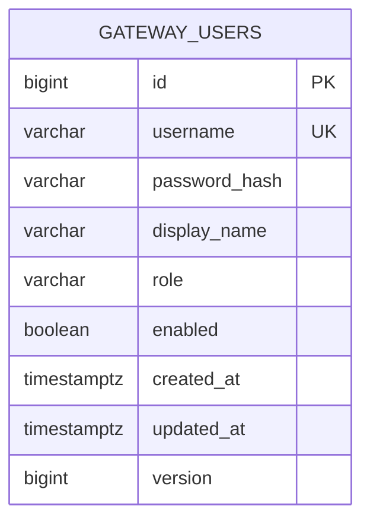
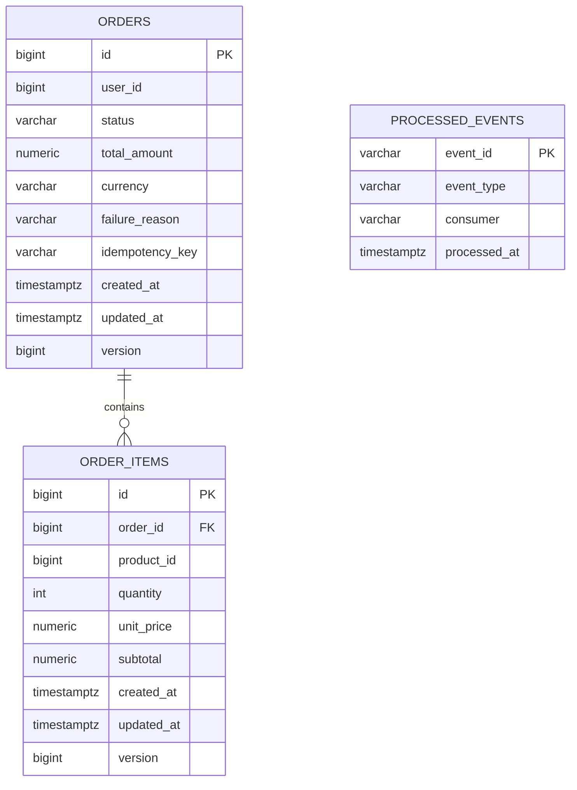
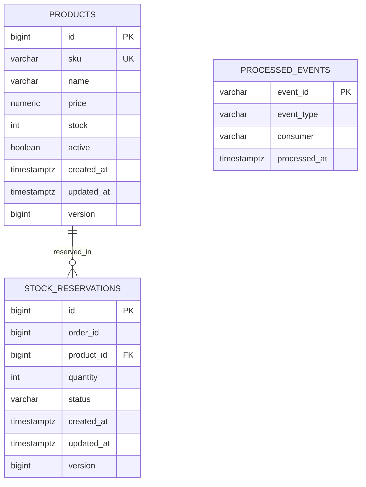
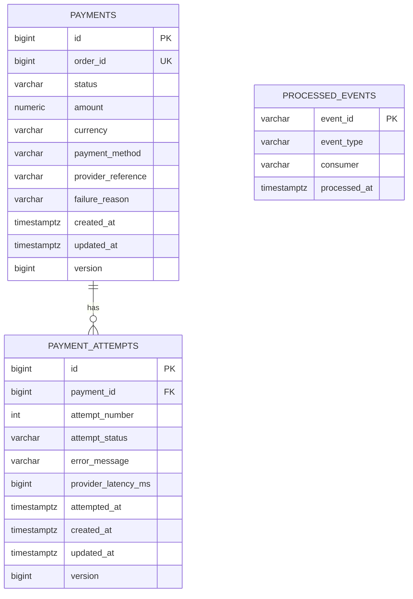
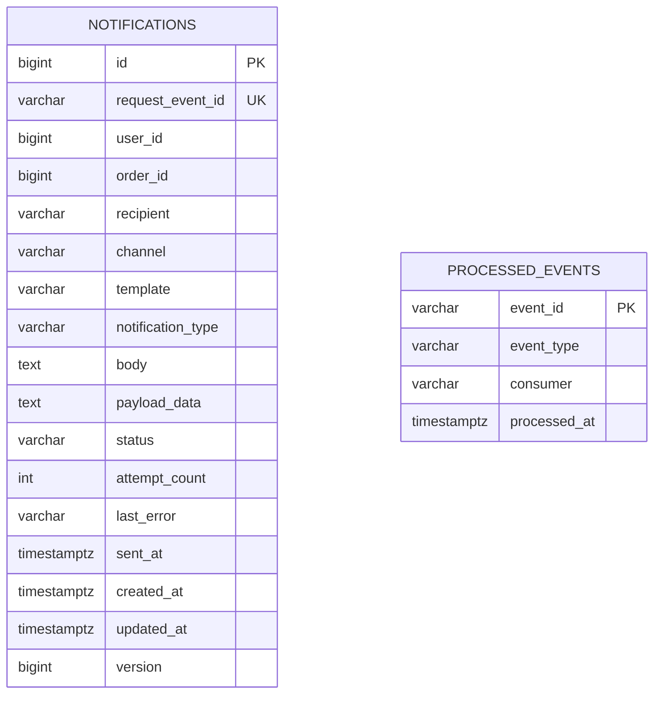
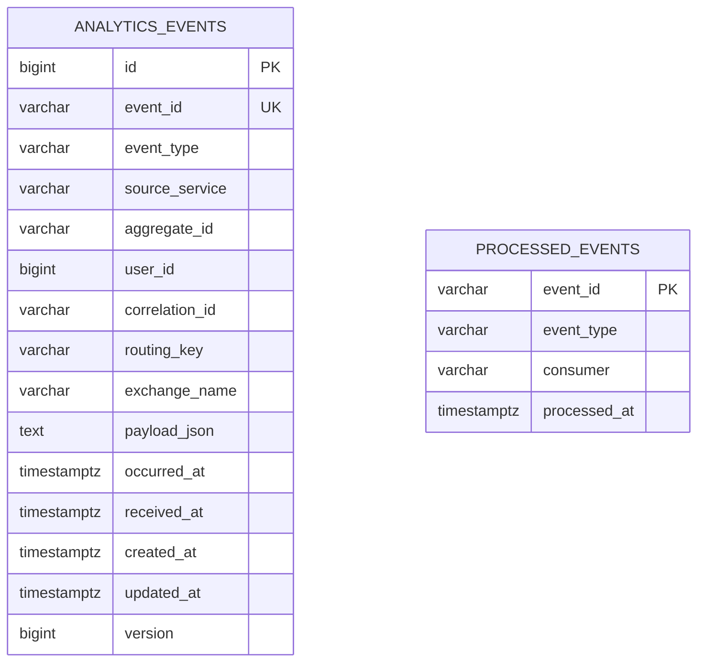

# Database

## Per-service database schema

### api-gateway

**Tables**
- `gateway_users`

**Purpose**
- Stores demo login credentials and role/enablement state for the gateway-owned auth API.

### order-service

**Tables**
- `orders`
- `order_items`
- `processed_events`

**Purpose**
- `orders`: order header and saga status
- `order_items`: immutable item snapshot captured at order time
- `processed_events`: inbound event idempotency markers for saga reactions

### inventory-service

**Tables**
- `products`
- `stock_reservations`
- `processed_events`

**Purpose**
- `products`: catalog/stock rows used by the inventory service
- `stock_reservations`: per-order reservation records
- `processed_events`: inbound event idempotency markers

### payment-service

**Tables**
- `payments`
- `payment_attempts`
- `processed_events`

**Purpose**
- `payments`: one payment aggregate per order
- `payment_attempts`: detailed simulated provider attempts
- `processed_events`: inbound event idempotency markers

### notification-service

**Tables**
- `notifications`
- `processed_events`

**Purpose**
- `notifications`: persisted outbound notification requests and delivery outcome
- `processed_events`: inbound event idempotency markers

### analytics-service

**Tables**
- `analytics_events`
- `processed_events`

**Purpose**
- `analytics_events`: immutable event log built from wildcard RabbitMQ fan-in
- `processed_events`: inbound event idempotency markers

## Mermaid ER diagrams

### api-gateway

### order-service

### inventory-service

### payment-service

### notification-service

### analytics-service

## ProcessedEvent idempotency design

Each event-consuming service owns a `processed_events` table with the same shape:
- `event_id` as primary key
- `event_type`
- `consumer`
- `processed_at`

Design characteristics:
- The event producer generates a stable `eventId` in `EventEnvelope`.
- On consume, the service inserts a marker row before performing business logic.
- A duplicate delivery causes a primary-key violation on `event_id`.
- The consumer interprets that violation as “already processed”, acknowledges the message, and skips re-running business logic.
- `ProcessedEvent` intentionally does not extend `BaseEntity`; it is a marker row, not a versioned aggregate.

This pattern is used in:
- `order-service`
- `inventory-service`
- `payment-service`
- `notification-service`
- `analytics-service`

## BaseEntity auditing

All main business aggregates extend `techlab-common`’s `BaseEntity`, which contributes:
- `id` — `BIGSERIAL`/identity primary key
- `createdAt` → `created_at`
- `updatedAt` → `updated_at`
- `version` → optimistic-lock version column

Implementation details:
- `@MappedSuperclass`
- `@CreatedDate` and `@LastModifiedDate`
- `AuditingEntityListener`
- `@Version`

This is visible in the SQL migrations, where business tables consistently include:
- `created_at TIMESTAMP WITH TIME ZONE NOT NULL`
- `updated_at TIMESTAMP WITH TIME ZONE NOT NULL`
- `version BIGINT NOT NULL DEFAULT 0`

It applies to entities such as:
- `GatewayUser`
- `Order`
- `OrderItem`
- `Product`
- `StockReservation`
- `Payment`
- `PaymentAttempt`
- `Notification`
- `AnalyticsEvent`
