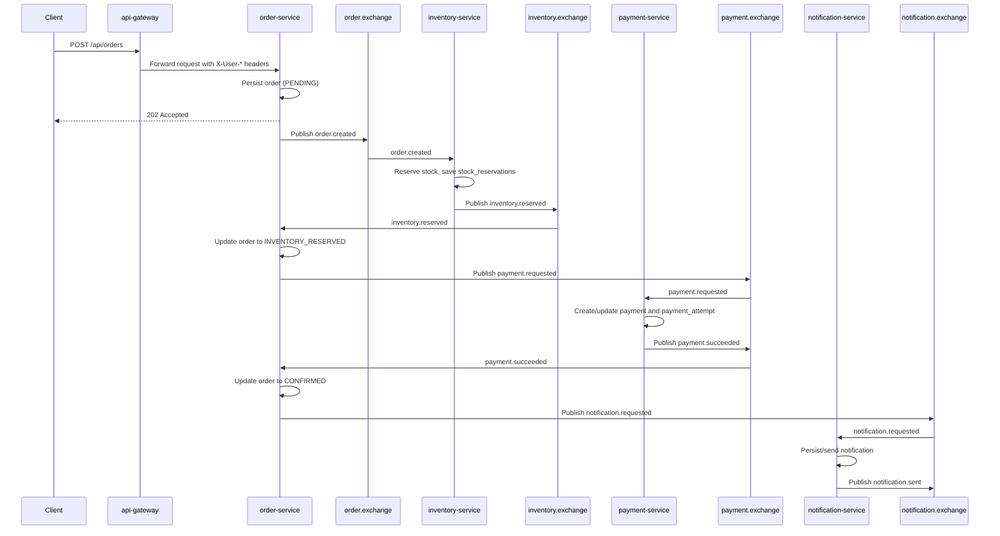
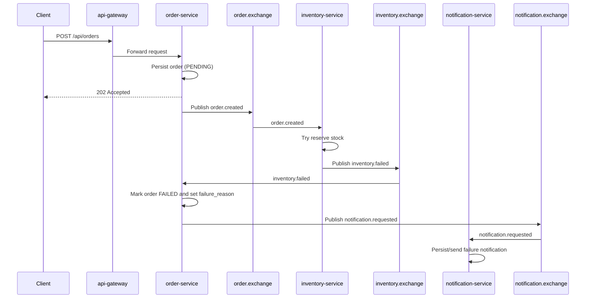
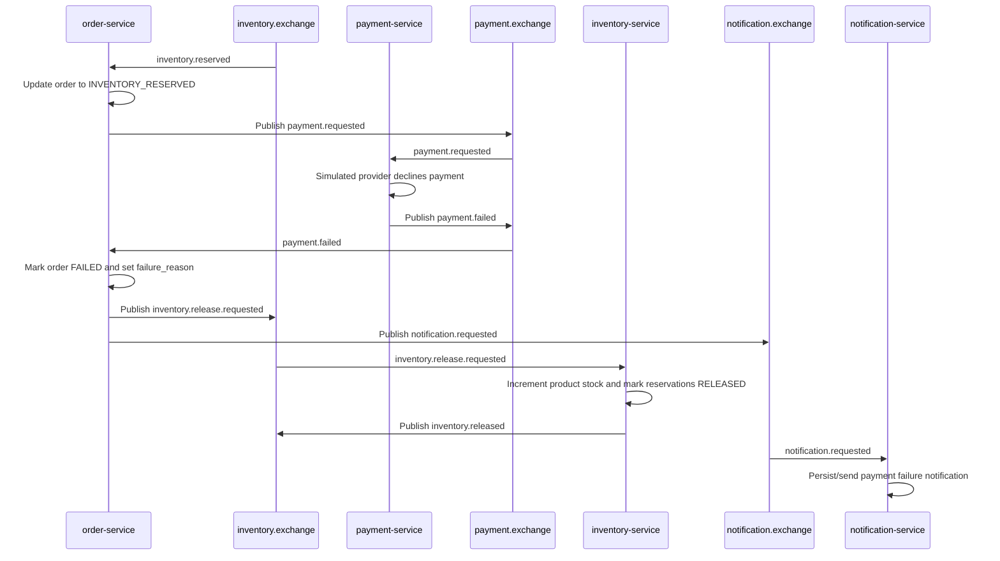
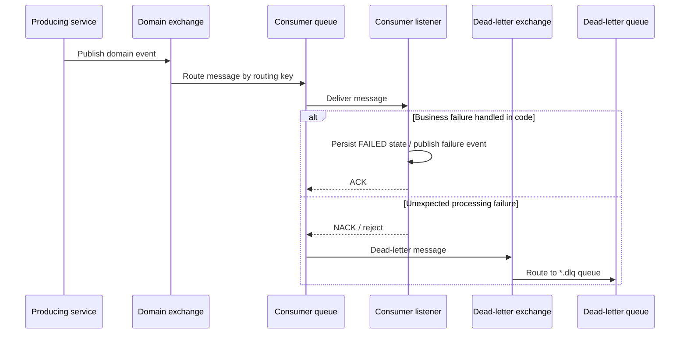

# Message flow

## Happy path order saga

```mermaid
sequenceDiagram
    participant C as Client
    participant G as api-gateway
    participant O as order-service
    participant RXO as order.exchange
    participant I as inventory-service
    participant RXI as inventory.exchange
    participant P as payment-service
    participant RXP as payment.exchange
    participant N as notification-service
    participant RXN as notification.exchange

    C->>G: POST /api/orders
    G->>O: Forward request with X-User-* headers
    O->>O: Persist order (PENDING)
    O-->>C: 202 Accepted
    O->>RXO: Publish order.created
    RXO->>I: order.created
    I->>I: Reserve stock, save stock_reservations
    I->>RXI: Publish inventory.reserved
    RXI->>O: inventory.reserved
    O->>O: Update order to INVENTORY_RESERVED
    O->>RXP: Publish payment.requested
    RXP->>P: payment.requested
    P->>P: Create/update payment and payment_attempt
    P->>RXP: Publish payment.succeeded
    RXP->>O: payment.succeeded
    O->>O: Update order to CONFIRMED
    O->>RXN: Publish notification.requested
    RXN->>N: notification.requested
    N->>N: Persist/send notification
    N->>RXN: Publish notification.sent
```

## Inventory failure compensation

```mermaid
sequenceDiagram
    participant C as Client
    participant G as api-gateway
    participant O as order-service
    participant RXO as order.exchange
    participant I as inventory-service
    participant RXI as inventory.exchange
    participant N as notification-service
    participant RXN as notification.exchange

    C->>G: POST /api/orders
    G->>O: Forward request
    O->>O: Persist order (PENDING)
    O-->>C: 202 Accepted
    O->>RXO: Publish order.created
    RXO->>I: order.created
    I->>I: Try reserve stock
    I->>RXI: Publish inventory.failed
    RXI->>O: inventory.failed
    O->>O: Mark order FAILED and set failure_reason
    O->>RXN: Publish notification.requested
    RXN->>N: notification.requested
    N->>N: Persist/send failure notification
```

## Payment failure compensation

```mermaid
sequenceDiagram
    participant O as order-service
    participant RXI as inventory.exchange
    participant P as payment-service
    participant RXP as payment.exchange
    participant I as inventory-service
    participant RXN as notification.exchange
    participant N as notification-service

    RXI->>O: inventory.reserved
    O->>O: Update order to INVENTORY_RESERVED
    O->>RXP: Publish payment.requested
    RXP->>P: payment.requested
    P->>P: Simulated provider declines payment
    P->>RXP: Publish payment.failed
    RXP->>O: payment.failed
    O->>O: Mark order FAILED and set failure_reason
    O->>RXI: Publish inventory.release.requested
    O->>RXN: Publish notification.requested
    RXI->>I: inventory.release.requested
    I->>I: Increment product stock and mark reservations RELEASED
    I->>RXI: Publish inventory.released
    RXN->>N: notification.requested
    N->>N: Persist/send payment failure notification
```

## Retry and DLQ flow

```mermaid
sequenceDiagram
    participant Producer as Producing service
    participant X as Domain exchange
    participant Q as Consumer queue
    participant C as Consumer listener
    participant DLX as Dead-letter exchange
    participant DLQ as Dead-letter queue

    Producer->>X: Publish domain event
    X->>Q: Route message by routing key
    Q->>C: Deliver message
    alt Business failure handled in code
        C->>C: Persist FAILED state / publish failure event
        C-->>Q: ACK
    else Unexpected processing failure
        C-->>Q: NACK / reject
        Q->>DLX: Dead-letter message
        DLX->>DLQ: Route to *.dlq queue
    end
```
